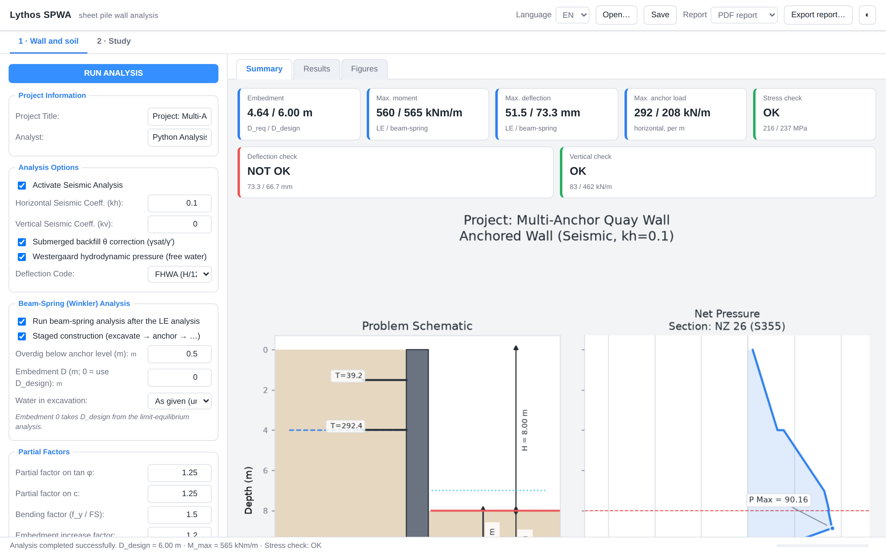
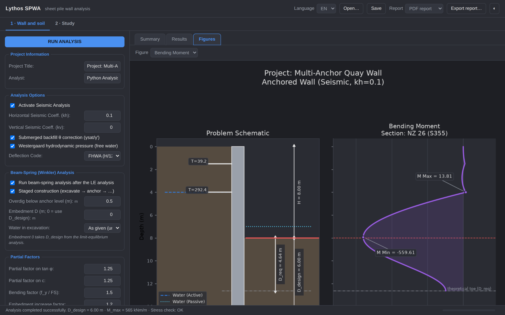
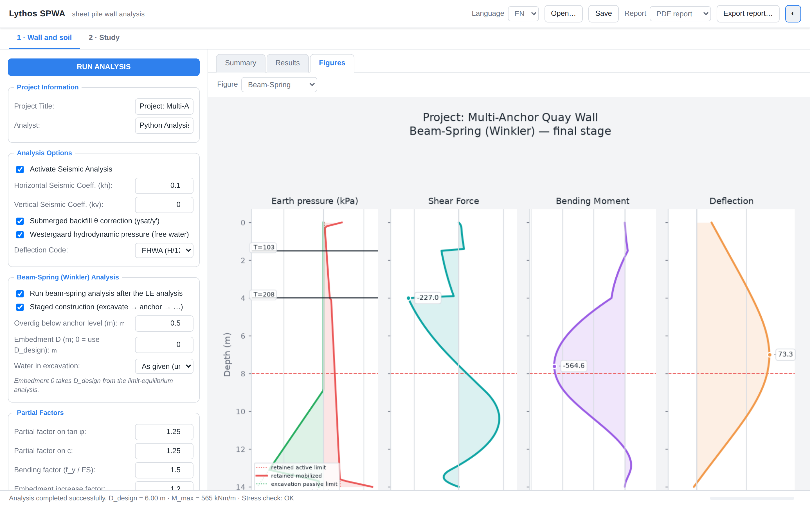
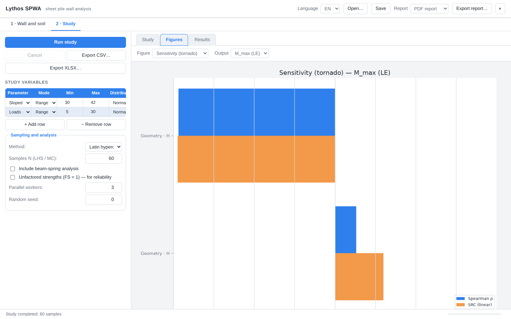

**English** | [Türkçe](README.tr.md)

# Lythos SPWA

[](https://github.com/hdaltuntas/lythosspwa/actions/workflows/tests.yml)
[](https://pypi.org/project/lythosspwa/)

Sheet pile wall analysis, driven from your browser. A cantilever or multi-anchored wall
is analysed two ways and the two are put side by side:

1. **Limit equilibrium** — the free-earth support method with Coulomb / Mononobe-Okabe
   earth pressures gives the *embedment depth, the anchor forces and the internal-force
   diagrams*.
2. **Beam-spring (Winkler)** — the wall as a beam on elastoplastic soil springs, built in
   stages, gives the *deflections and moments the sequence of construction actually
   produces*, with tension-only inclined anchors.

On top of either, a **parametric or reliability study** sweeps any input — a range, or a
distribution — and reports sensitivities, the probability of failure with a confidence
interval, and the reliability index β.

The whole program — every label, result text, figure and report — is bilingual in
**English and Turkish**, switchable while it runs.

The interface is a small HTTP server on your own machine, driven from a browser. That
keeps the program usable over a remote session or inside a container, where a desktop
toolkit would need a display it does not have, and it costs no dependency beyond the
standard library.

> This is the sibling of [LythosFEA](https://github.com/hdaltuntas/lythos) and
> [Lythos Kinematic](https://github.com/hdaltuntas/lythoskinematic), and follows the same
> architecture. It began life as the desktop program **SPWA**; see [Background](#background).

## Screenshots

| Results summary | Bending moment, dark theme |
|---|---|
|  |  |

| Beam-spring (Winkler) | Reliability study |
|---|---|
|  |  |

## Install & run

```bash
pip install lythosspwa
lythos-spwa                      # opens the interface in your browser
```

From a clone, with nothing installed but the scientific stack:

```bash
pip install numpy scipy matplotlib reportlab
python main.py
```

`main.py` puts its own directory first on the import path, so the clone's code
is what runs even when `lythosspwa` is also installed from PyPI. An editor such
as Thonny may warn that the folder is "shadowing the library module
`lythosspwa`" — that is the intended arrangement when you run from a clone, and
nothing is wrong; to work with the installed copy instead, run `lythos-spwa`
from any other directory.

Python 3.10+ is required. Word reports need `python-docx` and the spreadsheet export of a
study needs `openpyxl`; both are extras (`pip install "lythosspwa[docx,xlsx]"`), and the
interface offers those formats only when they are installed.

## Command line

```bash
lythos-spwa                                # web interface (the default)
lythos-spwa web --port 9000 --lang tr --no-browser
lythos-spwa example -o project.spwa        # a starter project file
lythos-spwa run project.spwa -o report.pdf # analyse, print the results, write a report
lythos-spwa study project.spwa -o samples.csv
```

`run` and `study` read the same `.spwa` file the interface saves, so a case set up in the
browser can be re-run unattended.

## What it computes

### Limit equilibrium (free-earth support)
- **Earth pressures:** Coulomb (static) and Mononobe-Okabe (seismic) for a vertical wall,
  with the cohesion term 2c√K and a tension cut-off on the active side
- **Embedment:** moment equilibrium about the toe (cantilever, simplified method) or about
  the lowest anchor (free-earth); solved by root-finding, `D_design = round-up(1.2·D_req)`
- **Anchors:** horizontal and axial force per anchor, and the vertical component
- **Diagrams:** net pressure, earth and water pressures, shear, moment, rotation, deflection
- **Checks:** bending stress against f_y / FS, deflection against H/120, H/100 or H/240,
  and an indicative vertical equilibrium check

### Beam-spring (Winkler)
- Euler-Bernoulli beam on elastoplastic springs bounded by the active and passive limits,
  starting from at-rest (K₀ = 1 − sin φ)
- **Staged construction**, worked out automatically: excavate to the anchor level plus the
  overdig, install the anchor, carry on to the final level; the springs keep their state
  between stages
- **Anchors** as tension-only springs, `k_h = EA/(L_free·s)·cos²α`, with a lock-off load
- **Subgrade modulus** kₛ entered directly, or from Ménard-Bourdon or Schmitt (1995)
- Water in the excavation either as given (underwater dredging) or dewatered until the
  final stage

### Seismic
- Mononobe-Okabe K_AE / K_PE, with the inertia angle θ computed from γsat/γ′ below the
  water table (restrained pore water)
- Westergaard hydrodynamic pressure of the free water in front of the wall,
  7/8·kh·γw·√(H_w·y), as a driving load

Both corrections can be switched off.

### Parametric and reliability studies
- **Variables:** any soil, anchor, geometry, load, seismic or factor input, as a range or
  as a distribution (normal, lognormal, uniform; mean and CoV)
- **Sampling:** one-at-a-time sweep, full grid, Latin hypercube, Monte Carlo; correlated
  inputs through the API (`Study(..., correlation={(a, b): rho})`)
- **Results:** Spearman rank and standardised regression sensitivities, failure
  probability with a 95 % confidence interval and the reliability index β, tornado charts
- Runs in parallel with progress and cancellation; exports to CSV / XLSX and becomes
  section 7 of the report

## Reports

Choose PDF, self-contained HTML or Word in the header and press *Export report…*. The
report carries the inputs (geometry, soil, anchors, section, options), the
limit-equilibrium results, the beam-spring results (kₛ table, stages, anchor forces,
checks, comparison with the LE analysis), the figures, the warnings and the method notes —
in whichever language the interface is in. All three formats are assembled from one place,
so they say the same thing.

## Project files (`.spwa`)

JSON. *Save* writes the inputs and the study definition; *Open…* reads them back. Files
written by SPWA v0.1 (anchor depths only, no kₛ fields) load with the defaults filled in.

## Modules

| file | content |
|---|---|
| `lythosspwa/analysis_engine.py` | Free-earth support analysis: Coulomb / Mononobe-Okabe pressures, embedment (brentq), anchor forces, diagrams at D_req, stress / deflection / vertical checks |
| `lythosspwa/beam_spring.py` | Winkler beam on elastoplastic springs with staged construction, tension-only inclined anchors, kₛ from Ménard-Bourdon or Schmitt |
| `lythosspwa/study.py`, `study_plots.py` | Parametric (OAT / grid) and reliability (LHS / Monte Carlo) studies: sampling with optional Gaussian-copula correlation, parallel runner, sensitivities, P_f with 95 % CI and β, CSV / XLSX export, figures |
| `lythosspwa/plotting.py`, `plot_style.py` | Matplotlib figures (schematic + diagrams, beam-spring 4-panel), theme-aware |
| `lythosspwa/report.py`, `pdf.py` | Calculation report: one HTML assembly, exported as PDF (reportlab), self-contained HTML or DOCX |
| `lythosspwa/forms.py` | Input schema and readers; converts between the interface's flat values and the engine's configuration |
| `lythosspwa/summary.py` | The results as summary cards and as text, for the browser and the command line alike |
| `lythosspwa/render.py` | Figures to PNG, off-screen (Agg) |
| `lythosspwa/web/` | The local HTTP server, the session that runs the analyses, and the browser interface |
| `lythosspwa/config.py` | Defaults, theme, plot palette, translations, section database |
| `lythosspwa/section_database.json` | I [m⁴/m] and W [m³/m] of sheet pile sections |

## Method notes

* LE: moment equilibrium about the toe (cantilever, simplified method) or the lowest
  anchor (free-earth). Internal forces are evaluated at the theoretical depth D_req;
  D_design = round-up(1.2·D_req) is the constructed length. For more than one anchor the LE
  distribution is approximate — the beam-spring results should govern.
* Seismic: Mononobe-Okabe with K_AE / K_PE (vertical wall); below the water table θ uses
  γsat/γ′ (restrained pore water); Westergaard hydrodynamic pressure of the free water in
  front of the wall is applied as a driving load.
* Beam-spring: p = clip(p_ref ± kₛ·Δw, p_a, p_p) per node, at-rest start; anchors
  T = max(0, P₀·cosα/s + k_h·Δw); moment from the element curvature (EI·w″).
* Vertical check (indicative): ΣT_h·tanα against the skin friction ∫(p_a + p_p)·tanδ over
  the embedded length; no end bearing.

## Development

```bash
pip install -e ".[dev]"
pytest -q                 # 106 tests: engine, beam-spring, report, study, forms, web, packaging
ruff check .
```

The tests cover the analysis cores against closed-form and published cases, the report in
all three formats, the input schema and its file round-trips, and the interface itself —
the session and the HTTP layer both, so the browser is exercised without a browser.

Releasing to PyPI is described in [docs/releasing.md](docs/releasing.md);
`tools/upload_to_pypi.py` does it from an editor, without a terminal.

## Background

Lythos SPWA is the desktop program **SPWA** (PyQt6 + Matplotlib) rebuilt as a web
application: the analysis cores are the same code, while the Qt interface has been replaced
by a local server and a browser page, and the Qt-based PDF writer by reportlab. Nothing in
the program needs a display any more, and it installs from PyPI in one command. This
repository supersedes the desktop program, which is no longer published separately.

## License

[MIT](LICENSE) © 2025 Hasan Deniz Altuntaş

## Author

Hasan Deniz Altuntaş
